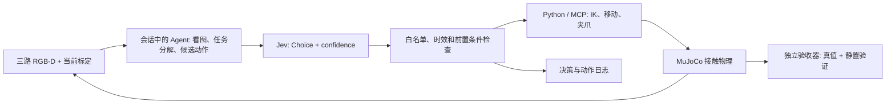

# 分层设计

## 各层负责什么

1. **Agent**：读图，识别任务进度和异常，选择需要哪一次观测，制定候选动作与检查方式。通过当前会话工具实现，不把 GPT 能力虚构成仓库里的本地模型。
2. **Jev**：对明确的状态问题作有限选项判断。输入英文 JSON 场景摘要；返回 choice、概率分布、confidence。官方端点固定为 `https://api.typesafe.ai/v1/systemone`，禁止跟随带凭据重定向。
3. **控制门控**：拒绝未知动作、非有限数、越界位姿、过期状态、错误分布。Jev 不返回 Python 源码，不产生 `eval/exec`。
4. **肌肉层**：以米、弧度和 world 坐标系运行；IK 在执行前计算整个路径。原 URDF 关节限位不被放宽；位置执行器推动动力学，夹持依赖接触。
5. **测量/验收**：感知基线用像素颜色与深度反投影；独立验收可读 MuJoCo 真值。两者的数据来源在日志中标明。

## 两种可复现的运行方式

`serve` / MCP 是 Agent 自由交互入口。会话中的 Agent 可以提出新的候选动作、检查照片并调整策略。没有 GPT API 密钥，也没有后台无限 Agent 循环。

`demo` 是本次 Agent 编写的受限实验流程：接近、下降、闭合、试提、转移、降低、松开、退臂。`--online` 让 Jev 对每一阶段从所有选项中选择。阶段校验会拦住跳步。若 Jev 要求重新观察、选择不满足条件的动作或接口失败，流程保存现场并交还交互入口，不将失败伪装成自动恢复。默认模式由确定性流程选择相同步骤，便于比较。

当前机器人研究问题应表述为：**把慢速 Agent 场景解释与快速结构化决策分离，能否减少调用开销，同时保留可检查的动作选择和失败反馈？** 本次实现证明接线与仿真流程可运行；它不证明 Jev 提高了抓取成功率，也不证明方法的首创性。

## 记录内容

保存观测依据、候选动作、选中的动作、简短理由、执行结果、恢复需求。Jev 本身不生成解释文字；Markdown 中的说明是 Agent 编写的任务级摘要，不冒充 Jev 的推理过程。

视频使用仿真时间。模型等待期间仿真暂停，这与真实机器人仍在物理世界中运行有区别。部署实机还需要独立实时控制、看门狗、急停、通信超时和真实标定；本仓库不连接硬件。
