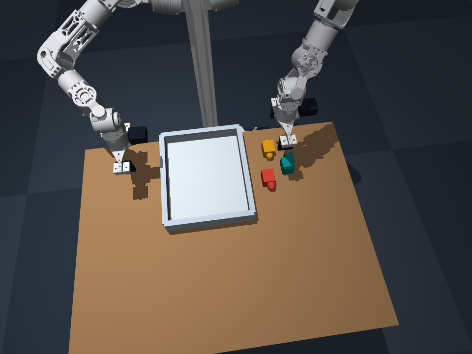
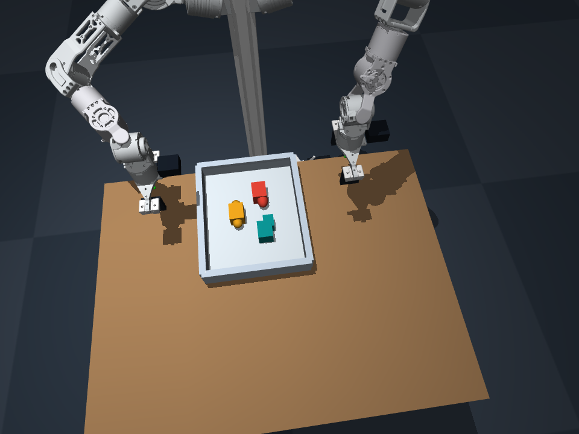

# 已验证的在线演示

2026-09-22，MuJoCo + 云弈 URDF，左臂收纳三个不规则组合物体。

- **真实 Jev**：24 次动作选择 + 1 次由会话 Agent 看图后提出的完成判断；模型 `jev-1.13.0`。
- **结果**：三件物体全部稳定放入盘内，松爪、退臂后通过独立物理验收。
- **视频**：[12.7 秒，约 4.02 倍仿真时间](episode_4x.mp4)。不是 4 倍墙钟时间录像。
- **证据**：[report.json](report.json)、[decisions.jsonl](decisions.jsonl)、[api_statistics.json](api_statistics.json)、[任务级决策摘要](decision_summary.md)。
- **复现环境**：[environment.json](environment.json)。

| 抓取前 | 抓取后 |
|---|---|
|  |  |

`observations/` 保留每次动作后的三相机及全景图片、相机标定。原始 `.npy` 深度保存在本地运行目录；重新执行可以生成。

这是使用 Agent 编写的有限流程进行的在线 Jev 演示，不包含后台 GPT API 调用。自由交互入口见仓库的 CLI/MCP 工具说明。调试阶段失败和首次低置信度停止见 [关键记录](../../docs/AGENT_NOTES.md)。
