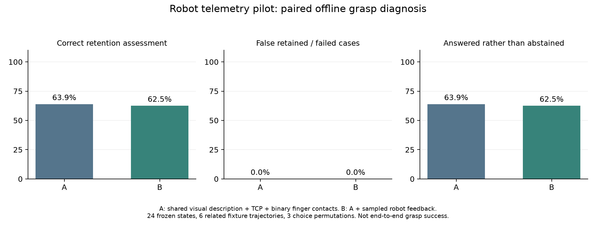
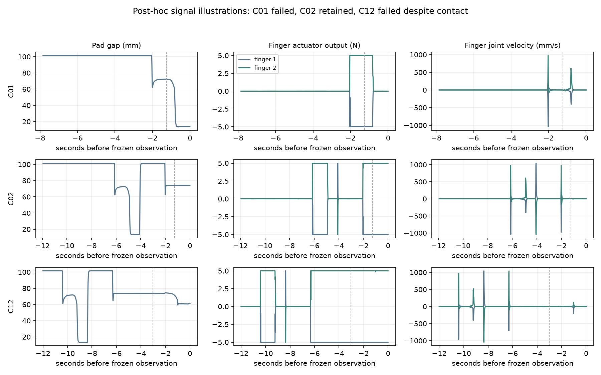

# 机械时序反馈配对试验报告

**结果：本轮没有证明加入机械时序摘要能改善 Jev 的夹持判断。** 原有视觉与接触反馈组正确 46/72（63.9%）；增加关节位置、速度、受力和夹爪间隙后正确 45/72（62.5%）。差异只有一次回答，不能据此断言机械反馈有害。两组明确作答时均正确，但分别有 26/72 和 27/72 次没有给出确定判断。

这是离线夹持判断试验，**不是完整抓取成功率或发现滑落延迟试验**。模型没有直接执行动作。评分器对每个冻结状态执行相同的短距离验证抬升，以物理结果作为标签。

## 设计与实际执行

- 2026-09-23，先提交[预注册方案](../../TELEMETRY_PILOT_PLAN.md)和采样/评估代码，提交号 `752b3ed`，之后才制作场景、标注图片、调用 API 和评分。
- 六条测试轨迹，每条固定取四个状态，共 24 个；第一条原参数，其余五条在初始化时随机改变物体质量、摩擦和小范围 XY 位置。期间不覆盖物体位姿，不粘附物体。
- 重放历史前 12 步命令仅用于制作测试状态，不是新的自动抓取策略。轨迹、目标外观与历史失败对标注者已知；这不是独立盲评，也不是广泛随机任务测试。
- 会话 Agent 实际查看了 96 张前后中央/腕部 RGB 图，以六张带标签的图片拼图检查全部状态。图像描述在查看新增数值摘要与评估真值前写好，同一份描述提供给 A/B。标注者没有打开本轮布局参数或读取物体坐标来描述图片。
- 输入冻结 SHA-256：`88973491d28b939d686fc7449ef1ffb3ba1567c5a62f8946a6329dc2d8b19e8b`。
- A：视觉描述、TCP、是否发出闭爪命令、匿名的左右指垫接触、上一步命令。**A 已经有接触反馈，不能称为纯视觉。**
- B：相同的 A 输入，加 100 Hz、最近最多 12 秒的机器人机械时序摘要。包含首尾、极值、首末最多 200 ms 均值；不是把完整原始波形直接给 Jev。
- 选项、指令、编号排列在配对内一致；每状态三个排列，随机 A/B 先后。固定 `jev-1.13.0`，共 144 次真实 TypeSafe 调用，全部有效、零重试。Jev 不直接读取图片。
- 选择冻结后才做独立物理验证：上抬 20 mm，检查动作前后双指接触目标、目标上升至少 10 mm、目标与 TCP 位移差小于 10 mm。24 个状态均可评分，其中 13 个通过、11 个未通过。
- 上述标签表示能否保持这次短抬升，不保证任意后续动作都不滑落。

## 结果

| 指标 | A：现有反馈 | B：增加机械时序 |
| --- | ---: | ---: |
| 门控后正确判断，observe 不算正确 | 46/72（63.9%） | 45/72（62.5%） |
| 原始选择正确率，门控前 | 55/72（76.4%） | 53/72（73.6%） |
| observe，包括低置信度门控 | 26/72 | 27/72 |
| 明确作答中的正确率 | 46/46 | 45/45 |
| 验证失败却判断 retained | 0/33 | 0/33 |
| 验证通过却判断 not_retained | 0/39 | 0/39 |
| 低于 0.55 置信度的响应 | 16/72 | 16/72 |
| 平均输入 token | 836.38 | 2846.92 |
| 平均 API 延迟 | 493.68 ms | 516.34 ms |



“明确作答全对”有覆盖率限制：两组分别只对 63.9% 和 62.5% 的查询作出确定判断。不能隐去 observe，宣传成 100% 抓取判断准确率或零失败风险。

门控后差异仅来自 C11 的一个排列：A 判断 retained，B 判断 observe；其余配对的最终语义选择相同。B−A 为 −1.39 个百分点，按六条轨迹聚类 bootstrap 的 95% 区间为约 −4.17 至 0.00 个百分点，来源级符号检验 p=1.0。只有一个来源出现差异，样本很小且轨迹高度相似；不能把这个区间解释为稳健的负面效应或等价证明。模型生成随机性也未固定。

B 的输入量是 A 的约 **3.40 倍**。本轮新增摘要没有带来相应的判断收益。该开销只适用于当前字段与编码，不代表所有机械反馈表示都如此昂贵。

## 从信号中实际看到了什么

下面是**评分完成后选取的说明性例子**，不作为新增独立试验，也没有据此回调阈值或重跑主结果：

| 状态 | 冻结时的机械反馈 | 独立验证 |
| --- | --- | --- |
| C01 | 双指无接触，间隙约 13.5 mm，夹爪执行器输出接近 0 N | 未保持夹持 |
| C02 | 双指接触，间隙约 74.2 mm，两指输出约 −5/+5 N | 保持夹持 |
| C12 | 双指接触，间隙约 61.1 mm，两指输出同样约 −5/+5 N | 未保持夹持 |
| C24 | 双指接触，间隙约 35.0 mm，输出约 −3.77/+3.77 N；视觉中已明显旋转 | 仍通过短抬升 |



图中虚线为当前待判断动作的开始。窗口可能包含更早的闭合、张开和重抓；它不等于“当前动作的全部时序”。这可能削弱摘要的可解释性，但本轮没有单独检验窗口设计。

这些记录说明：信号确实随接触与开口变化；但接触、非零受力或明显旋转都不能单独决定夹持标签。C12、C16 在冻结时双指仍有接触和受力，却没有通过随后的验证抬升。**不能将“记录到了受力变化”写成“模型因此判断得更好了”。**

## 为什么不能下更强的结论

1. 未分别消融关节角度、速度、夹爪间隙和受力，因此无法指出哪个信号有用、无用或造成干扰。
2. 当前摘要有大量数值，时间窗口混合多个动作；没有动作对齐的“闭合是否受阻”“试提期间是否失去持续受力”等经过独立标定的事件特征。它们值得下一轮测试，但尚不是已证实原因或改进。
3. 两组共享 Agent 的描述和已有接触布尔值，明显夹空状态本来就已可识别。新增信息的边际收益空间有限，但不能据此推断在遮挡、噪声或异步条件下的效果。
4. 六条轨迹共享脚本、目标和相似布局，来自同一个机器人模型；没有真实传感噪声或实机标定。力是仿真执行器广义力，不是已经分离的接触力。
5. 只看动作后端点并做短抬升验证，未测最早何时发现滑落、首次抓取成功率或完整任务耗时。observe 可能在闭环中有价值，这里没有评估其后续价值。
6. 本轮采用专用夹持判断问题，选项不直接执行，也不是 V2 动作协议。当前 V2 的 release 恢复限制与默认姿态没有被修改；旧实验结果保持不变。

## 复现与工程验证

实验输入、图片、原始时序、真实响应、评分标签和逐状态结果均随报告公开。布局参数在决策完成后才公开为 `setup_revealed_after_decisions.json`。

- `annotations/`：实际看图后的共享描述及时间。
- `cases/`：四张 RGB、相机标定、场景、冻结物理状态、`robot_telemetry.npz`、观测收据。
- `frozen.json`、`request_plan.json`：完整冻结输入及请求配对。
- `api_results.jsonl`：所有真实选择、概率、置信度、时间和 token。
- `labels.json`、`scoring/`：独立验证的结果和动作后图片。
- `summary.json`、`per_state.csv`：主结果和逐状态结果。
- `frozen_methods.py`：试验开始时的源码快照，仅用于审计。统计导出时发现 NumPy 整数无法 JSON 序列化，现行脚本仅将来源胜负计数转换成 Python int；没有改变统计公式、样本、标签或阈值。此故障及修复不计为额外 API 调用。
- `artifact_integrity.json`：发布文件哈希；这是完成后的导出校验，不冒充试验前冻结。

北京时间 12:35:29 开始制作状态，12:38:05 完成输入冻结。144 次 API 的请求阶段共约 72.74 秒，不包含场景制作、看图、物理评分和报告时间。

机器人采样为可选功能，默认关闭。采样开关对照测试确认相同命令产生的 q、dq 逐值一致；记录本身没有改变物理过程。记录单位、时间恢复、窗口长度、配对输入一致性和统计导出均有测试，56 项测试全部通过。使用方式见[机械反馈文档](../../../docs/ROBOT_TELEMETRY.md)。

已从公开导出的状态在本机新目录离线复算 24 次验证抬升：所有物理标签及统计字段与原结果完全一致。96 张 RGB、24 份原始机械记录、输入及方案哈希均通过检查，核验记录见 `reproduction_verification.json`。复算不是新增独立试验。

已有结果无需再次调用 API 即可复核。在仓库根目录、激活项目 `.venv` 后，使用新的空目录：

```bash
mkdir -p runs/telemetry_reproduce
cp experiments/results/telemetry_pilot_01/frozen.json runs/telemetry_reproduce/
cp experiments/results/telemetry_pilot_01/request_plan.json runs/telemetry_reproduce/
cp experiments/results/telemetry_pilot_01/api_results.jsonl runs/telemetry_reproduce/
cp -r experiments/results/telemetry_pilot_01/cases runs/telemetry_reproduce/
env -u PYTHONPATH PYTHONNOUSERSITE=1 python scripts/benchmark_telemetry.py score --run-dir runs/telemetry_reproduce
env -u PYTHONPATH PYTHONNOUSERSITE=1 python scripts/benchmark_telemetry.py analyze --run-dir runs/telemetry_reproduce
```

下一轮应预先固定按动作分段的紧凑特征，在新状态上比较现有摘要与新表示，并分别检验夹爪和手臂信号。当前结果支持继续研究这些具体问题，尚不支持把机械摘要作为默认输入并宣称已提高抓取效果。
