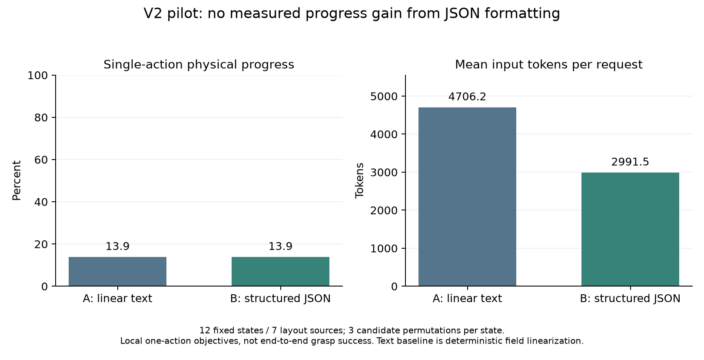

# V2 小样本对照试验报告

**结论：本轮没有证据表明结构化 V2 提高了单步动作效果。** 在相同事实和候选下，文本组与 JSON 组的物理进展率均为 13.9%。JSON 组的平均输入 token 较本试验的逐字段文本基线少 36.4%。这不能证明完整抓取成功率提高，也不能证明 Jev 优于当前会话 Agent。

## 试验实际做了什么

2026-09-23，先提交[预注册方案](../../V2_PILOT_PLAN.md)，提交号 `4828155`，然后完成 12 个状态、三种候选排列、两种输入形式，共 72 次真实 TypeSafe 调用。模型固定为 `jev-1.13.0`，全部请求成功，无重试、无伪造响应。

- 六个历史状态来自已经记录的真实命令，重新构建为冻结测试状态，涵盖试提失败、保持夹持、滑落、闭爪、松爪和完成。重放只用于制作测试状态，不是新策略。
- 六个新场景随机改变三个物体的位置和绕 Z 的朝向。决策会话看中央与腕部 RGB 和机器人反馈，没有打开种子、位置文件、场景 XML 或物体真值。生成分布、机器人和物体类型已知，这不是第三方双盲。
- A 是同一状态逐字段线性化的文本句子，B 是原始 JSON；完整动作参数、条件、未知项和证据一致。A 不是任意人工精简摘要。
- 所有视觉标注和 C 的选择在 API 调用前保存并冻结。`frozen.json` SHA-256：`b56c5a639266d7e848d19aaf851f2866ec16864e81f2c1d4b1dd41ce1e0d61e3`。
- 选择冻结后才运行独立物理评分。每个动作从同一状态副本开始，成功依据先定的局部目标，而不是是否符合 Agent 的答案。相同状态、相同动作共用一次评分结果，共实际评估 20 个不同的状态/动作组合。

## 主要结果：单步物理进展

| 指标 | A：逐字段文本 + Jev | B：结构化 JSON + Jev |
| --- | ---: | ---: |
| 有效响应 | 36/36 | 36/36 |
| 达成预定局部目标的选择 | 5/36 | 5/36 |
| 平均单步进展率 | 13.9% | 13.9% |
| 最终执行 observe | 31/36 | 31/36 |
| 原始 Choice 违反条件 | 0/36 | 0/36 |
| 触发低置信度门控 | 7/36 | 8/36 |
| 平均输入 token | 4706.25 | 2991.50 |
| 平均 API 延迟 | 519.86 ms | 483.37 ms |
| 重复/排列下选择发生变化的状态 | 2/12 | 1/12 |

低置信度计数包括原本就选择 observe 的响应，不代表有 7 或 8 个移动被拦截。每组原始 Choice 都有 9 次非 observe，最终保留 5 次非 observe。

12 个状态中的六个历史状态来自同一条轨迹。因此不把 36 次排列或 12 个状态全部当成独立样本；按七个布局来源聚类。B−A 为 **0.0 个百分点**，预设的聚类 bootstrap 95% 区间约 **−14.3 至 +4.5 个百分点**；来源级双侧符号检验 p=1.0。这是小样本探索性估计，不是两种格式等价的证明。

输入 token 减少是本轮实测结果，但 A 包含重复字段路径的文本开销，不能推广为“JSON 比所有自然语言摘要都省 36%”。延迟差异也不足以独立证明系统总耗时下降。排列试验未固定模型生成随机性，选择变化不能全部归因于候选位置。



## 每个状态的结果

下表 A/B 为三个排列的物理评分均值。C 是提前保存的会话 Agent 参考选择，经过同样的动作门控。

| 状态 | 预定局部目标 | A | B | C（参考） |
| --- | --- | ---: | ---: | ---: |
| H01 | 抓空后张开夹爪 | 0 | 0 | 0 |
| H02 | 保持夹持继续升高 | 1/3 | 0 | 1 |
| H03 | 滑落入盘后松爪 | 0 | 0 | 1 |
| H04 | 红色闭爪后试提 | 1 | 1 | 1 |
| H05 | 青色松爪后退臂 | 0 | 0 | 1 |
| H06 | 已收纳完成的最终验证 | 0 | 2/3 | 1 |
| R01 | 随机黄色目标的水平对准 | 1/3 | 0 | 0 |
| R02 | 同上 | 0 | 0 | 0 |
| R03 | 同上 | 0 | 0 | 1 |
| R04 | 同上 | 0 | 0 | 0 |
| R05 | 同上 | 0 | 0 | 1 |
| R06 | 同上 | 0 | 0 | 1 |

C 共 8/12（66.7%）。**C 不是严格隔离的因果对照，不能据此宣称 Agent 的模型能力优于 Jev。** 会话 Agent 参与图像解释和候选设计，保留了原始图片的上下文；它的选择在编译器返回完整 IK 预检之前保存，而 Jev 看到了预检结果。这与严格“相同信息、独立选择器”的理想条件有偏差。C 的四个失败中，一个被 release 条件拦截，三个被 IK 拦截。没有在看到结果后为 C 改选动作。

## 找到的具体问题

### 1. 恢复动作被协议错误限制

H01 的合理恢复是张开已经抓空的夹爪。但 V2 只有 release 意图，要求目标在盘内；桌面上的失败重抓无法满足这一条件。原始 C 选择因此被改为 observe。

主试验结束后进行了单独诊断：从 H01 的同一状态直接执行已经预先选定的开爪命令，只绕过该意图条件。夹爪成功打开，目标位移约 `7.66e-11 m`，满足原本的恢复目标。这个事后诊断证明了该限制的具体问题，**不计入主要结果，也没有覆盖原失败**。证据在 `diagnostics/recovery_open/result.json` 和对应图片。

### 2. 视觉上可走不等于关节可达

R01、R02、R04 中 C 提出的 +Y 40 mm 移动被 IK 预检拒绝。URDF 关节限位没有放宽。以后应让 Agent 在最终选择前获得与 Jev 一样的预检结果，并重新提出较小或不同方向的候选；不能把这些失败当成纯视觉识别错误。

### 3. 两种输入都经常停在观察

A/B 均有 31/36 次最终执行 observe，直接限制了单步进展。部分观察来自模型原始选择，部分来自置信度门控。完整未知项、信息冗余、缺少明确的相机相对方向到运动方向关系，以及问题表述都可能有关，但本试验没有分别消融，不能指定其中一个为已证实原因。

本轮只评分一个动作的物理进展，没有执行“观察后再次决策”。因此不能据此判断所有 observe 都是不合理的，也没有测量额外观察对后续安全性或完成率的价值。

V2 对图像事实的格式约束已实现，但不能据此声称提高了视觉提取准确率；本实验共享同一份 Agent 提取结果，也没有独立图像标注者。

## 时间与复现

以下时间为北京时间（UTC+8）。

- 11:37:52 开始制作冻结状态，11:43:39 完成图像标注与 C 选择冻结：约 5.79 分钟，包含制作场景、工具操作和会话看图。
- 11:43:53–11:44:29 完成 72 次 API 请求：约 36.13 秒。
- 后续另有物理评分、统计、诊断和报告制作。上述时间不是完整收纳任务耗时，也不是纯模型思考时间。
- 最初一次场景生成因无显示器环境的 OpenGL 导入顺序失败，修复后重新生成整批测试状态；失败发生在标注和 API 之前，没有挑选或删除模型结果。绘图库安装也不计入 API 延迟。
- 52 项代码测试通过。测试通过只支持工具实现可靠性，不作为算法优越性证据。

证据文件：

- `annotations/`：Agent 的图片判断、完整提案、预先保存的 C 选择。
- `frozen.json`、`request_plan.json`：规范化输入与 72 个固定请求。
- `api_results.jsonl`：真实 Jev 返回、使用量、时间和门控。
- `physical_scores.json`、`per_state.csv`、`summary.json`：物理评分与统计。
- `cases/`：相机图片、收据、模型和冻结物理状态；`scoring/`：动作后的图像。
- `setup_revealed_after_decisions.json`：选择与评分完成后公开的布局种子和位置。它没有提供给决策环节。
- `artifact_integrity.json`：导出文件哈希；冻结提案哈希发生在 API 前，导出哈希发生在实验完成后，两者不要混淆。

已有结果可以不调用 API 重新评分。在仓库根目录，激活项目 `.venv` 后：

```bash
mkdir -p runs/v2_reproduce
cp experiments/results/v2_pilot_01/frozen.json runs/v2_reproduce/
cp experiments/results/v2_pilot_01/api_results.jsonl runs/v2_reproduce/
cp -r experiments/results/v2_pilot_01/cases runs/v2_reproduce/
env -u PYTHONPATH PYTHONNOUSERSITE=1 python scripts/benchmark_v2.py score --run-dir runs/v2_reproduce
env -u PYTHONPATH PYTHONNOUSERSITE=1 python scripts/benchmark_v2.py analyze --run-dir runs/v2_reproduce
```

使用新的空目录，评分器拒绝覆盖已有动作结果。跨机器时仅在评分副本中重定位机器人网格路径。固定模型和物理参数可复核此次分数；不能保证重新调用云端模型得到相同选择。

已经按上述步骤在本机新目录离线复算：20 个不同状态/动作的物理评分与原记录完全一致，统计结果所有字段也完全一致；192 张归档 RGB 图片、预先冻结的提案和布局文件通过哈希核验。机器可读核验记录见 `reproduction_verification.json`。这是复现检查，不是新增独立试验。

## 下一轮应检验什么

先增加明确的“抓取失败后开爪恢复”意图；让各选择器获得相同预检信息；补充可审计的相对对准方向，区分动作所需未知项和无关未知项。之后用新的随机布局、独立标注与选择环节重做试验，再扩大到完整闭环抓放。当前结果支持这些具体改进方向，**不支持“V2 已提升抓取成功率”或“Jev 已证明优于 Agent”这两项结论**。
